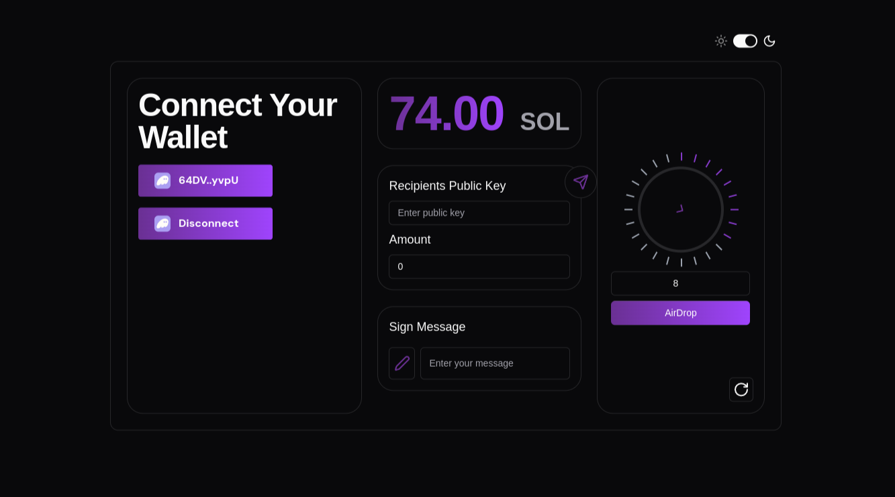

# Solana Faucet

A sleek, interactive Solana faucet with unique features for token airdrops and transfers.



## Key Features

- **User-Friendly Interface**: Enjoy a polished and intuitive UI.
- **Rotating Dialer**: Rotate the dialer to claim your airdrop, adding a fun, interactive element.
- **Token Transfer**: Easily send tokens to others within the app.
- **Secure Authentication**: Authenticate by signing messages to ensure transaction security.

## Getting Started

1. **Clone the Repository**:

   ```bash
   git clone https://github.com/X9Z0/solana-faucet.git
   cd solana-faucet
   ```

2. **Install Dependencies**:

   ```bash
   pnpm install
   ```

3. **Run the App**:
   ```bash
   pnpm run dev
   ```

This will start the development server, and you can view the app in your browser.
